<div align="center">

<picture>
  <source media="(prefers-color-scheme: dark)" srcset="assets/app_logo/Tweakd%20SVG%20logo%20transparent%20-%20Dark%20version.svg">
  
</picture>

**The social network for car people.**

Show off your build, log every mod, find meets near you and talk shop with people who get it.


</div>

---

## Contents

1. [Overview](#overview)
2. [Screenshots](#screenshots)
3. [Features](#features)
4. [Tech stack](#tech-stack)
5. [System context](#system-context)
6. [Architecture](#architecture)
   - [Layers and dependency rule](#layers-and-dependency-rule)
   - [A request, end to end](#a-request-end-to-end)
   - [Dependency injection](#dependency-injection)
   - [Routing and BLoC provisioning](#routing-and-bloc-provisioning)
7. [Core subsystems](#core-subsystems)
   - [Networking and the error pipeline](#networking-and-the-error-pipeline)
   - [Authentication](#authentication)
   - [Realtime: direct messages and contests](#realtime-direct-messages-and-contests)
   - [Push notifications](#push-notifications)
   - [Deep links](#deep-links)
   - [Startup performance](#startup-performance)
   - [Media uploads](#media-uploads)
   - [Analytics and privacy](#analytics-and-privacy)
   - [Localization, theming and responsive layout](#localization-theming-and-responsive-layout)
8. [Security posture](#security-posture)
9. [Testing strategy](#testing-strategy)
10. [Trade-offs and known limitations](#trade-offs-and-known-limitations)
11. [Getting started](#getting-started)
12. [Project status](#project-status)

---

## Overview

Tweakd is a mobile app for car enthusiasts. It combines a **social feed**, a **digital garage** for your cars and their modifications, an **interactive 3D map** of car meets and automotive businesses, **forums**, and **real-time direct messages**.

I designed and built the Flutter client end-to-end: the architecture, the UI/UX, authentication, real-time features, push notifications, maps, localization and the test suite. The app talks to a REST API for application data and to Supabase for identity, realtime and a few account-level operations.

| | |
|---|---|
| **~115k** lines of Dart | **20** feature modules |
| **140** use cases | **68** BLoCs / Cubits |
| **57** routes | **950+** automated tests |
| **2** languages (English, Romanian) | Light, dark and system themes |

Most feature folders have their own `README.md` with that feature's flows and API contract (see [`lib/features/`](lib/features/)). Project-wide conventions live in [`CLAUDE.md`](CLAUDE.md) and [`CONTEXT.md`](CONTEXT.md), which double as context for AI-assisted development.

## Screenshots

<table>
  <tr>
    <td align="center" width="25%">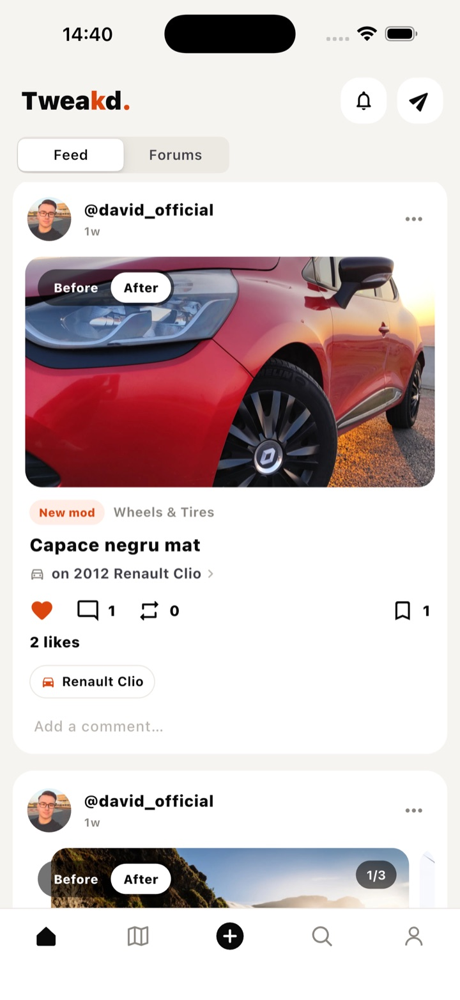<br><sub><b>Feed</b></sub></td>
    <td align="center" width="25%">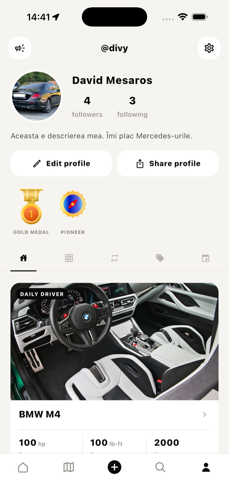<br><sub><b>Profile</b></sub></td>
    <td align="center" width="25%">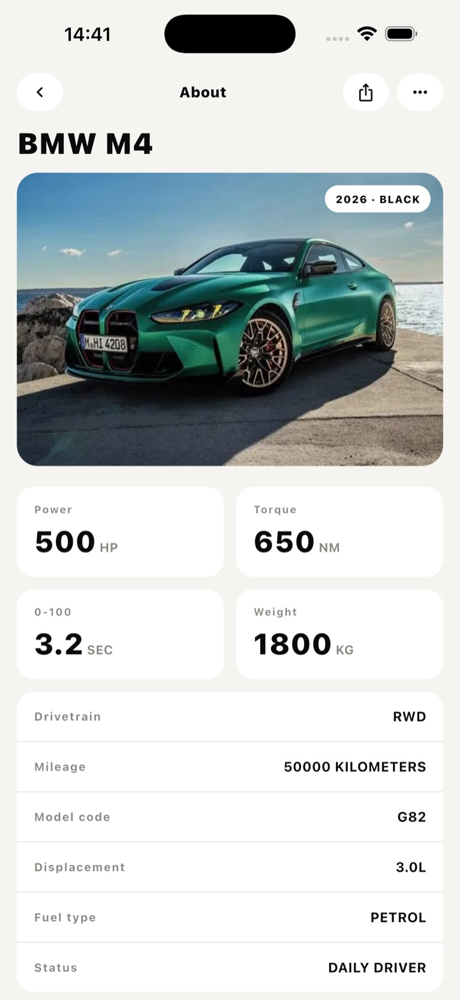<br><sub><b>Car details</b></sub></td>
    <td align="center" width="25%">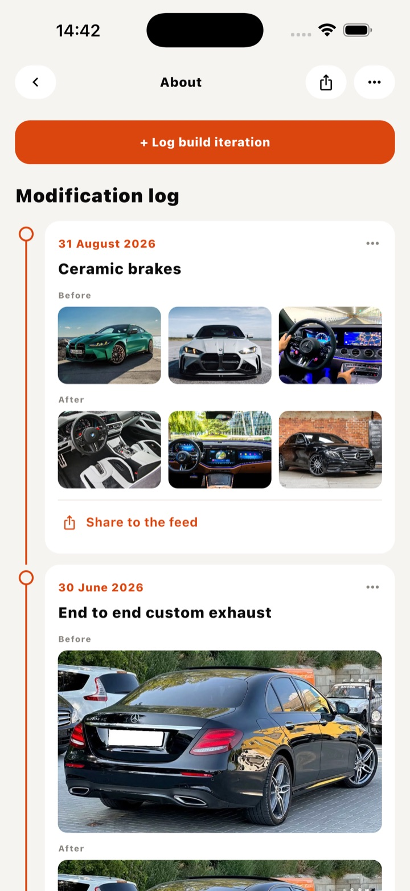<br><sub><b>Build log</b></sub></td>
  </tr>
  <tr>
    <td align="center" width="25%">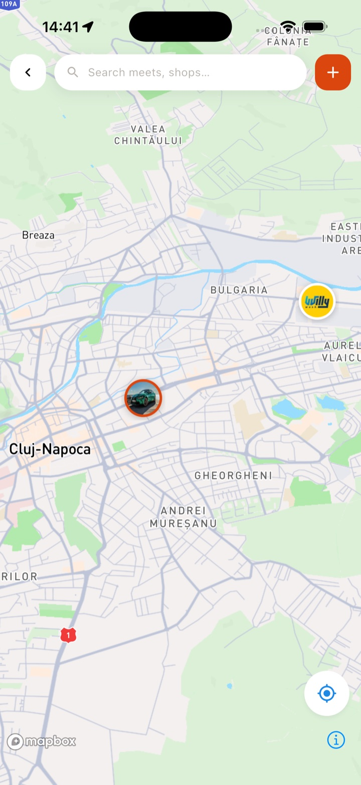<br><sub><b>Map</b></sub></td>
    <td align="center" width="25%">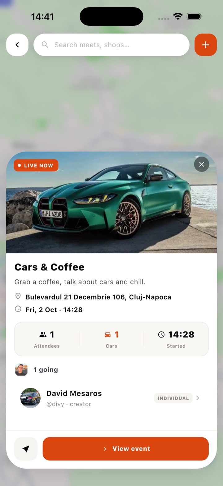<br><sub><b>Live event</b></sub></td>
    <td align="center" width="25%">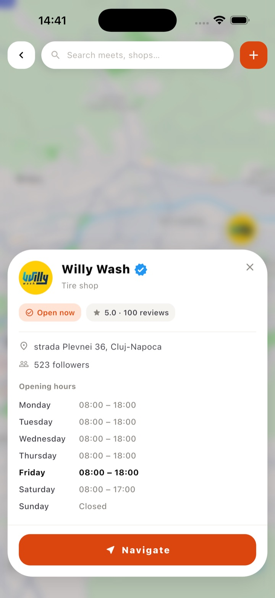<br><sub><b>Business</b></sub></td>
    <td align="center" width="25%">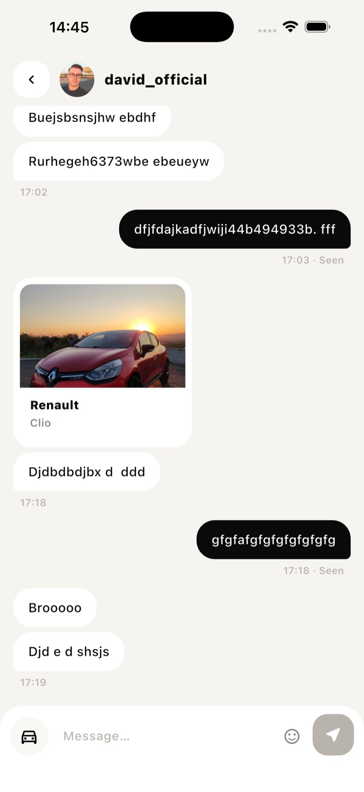<br><sub><b>Direct messages</b></sub></td>
  </tr>
  <tr>
    <td align="center" width="25%">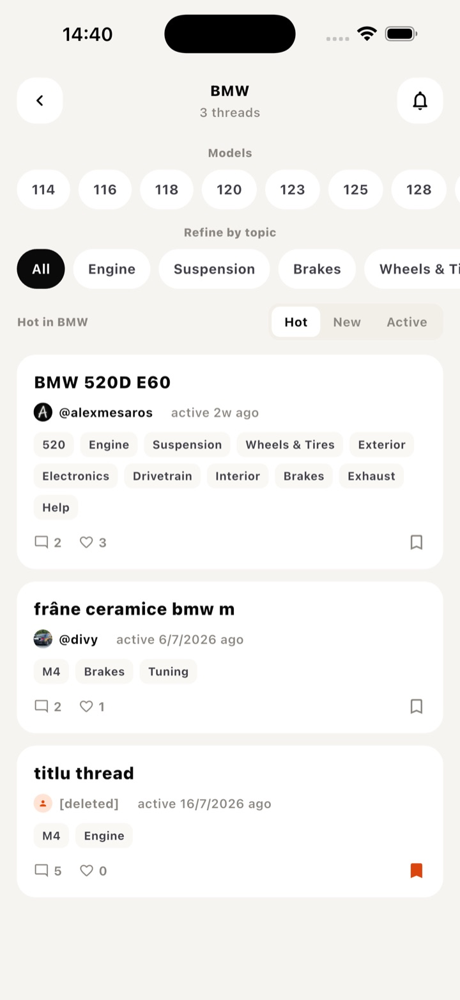<br><sub><b>Forum</b></sub></td>
    <td align="center" width="25%">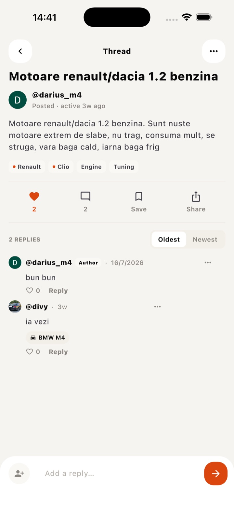<br><sub><b>Forum thread</b></sub></td>
    <td align="center" width="25%">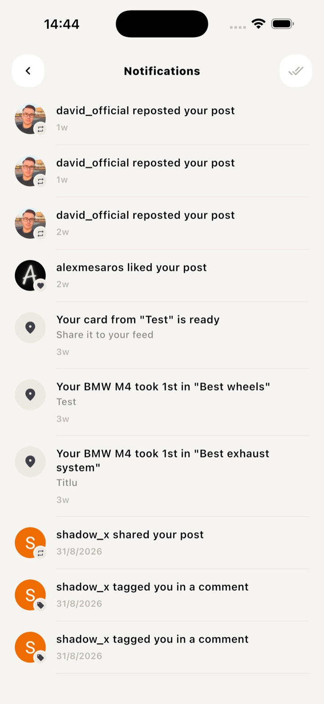<br><sub><b>Notifications</b></sub></td>
    <td align="center" width="25%">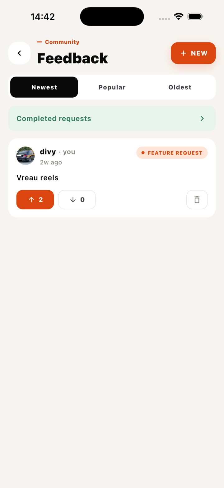<br><sub><b>Feedback board</b></sub></td>
  </tr>
  <tr>
    <td align="center" width="25%">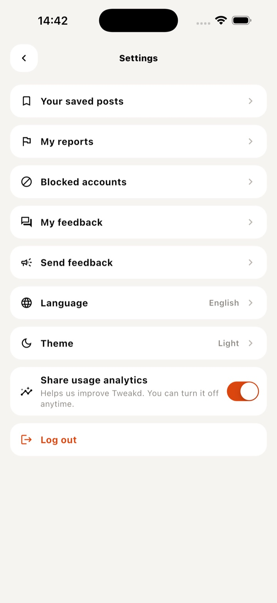<br><sub><b>Settings</b></sub></td>
  </tr>
</table>

## Features

| Area | What it does |
|---|---|
| **Feed** | Global feed of photo posts ranked by engagement; likes, comments, saves, reposts; tag people and cars |
| **Profiles** | Own and public profiles, followers/following, follow requests, tagged-in tab, badges with an unlock celebration |
| **Garage** | Cars with full specs and photo galleries, a build log of modifications, optional "share this mod to the feed", share links and QR codes |
| **Map** | Mapbox 3D map of car meets and businesses; paginated search with live/upcoming/past filters |
| **Events** | User-created events with admin approval, organizer tools, attendee management, public web links, car contests with live vote counts |
| **Forums** | Topic and brand-based threads, replies, likes, saved threads |
| **Messages** | One-to-one DMs with live delivery, typing indicator, read receipts ("Seen") and unread badges |
| **Notifications** | In-app list and FCM push; tapping either opens the right screen |
| **Trust & safety** | Reporting (posts, comments, profiles, forum content), two-way blocking, a public feedback board with voting |
| **Account** | Email/password with OTP verification, Google and Apple sign-in, password reset, language and theme settings, opt-in analytics |

## Tech stack

| Area | Technology |
|---|---|
| Framework | Flutter, Dart 3 (sealed classes, switch expressions, pattern matching) |
| State management | `flutter_bloc` (BLoC for event-driven flows, Cubit for simple state) |
| Architecture | Clean Architecture per feature; `dartz` `Either<Failure, T>` across layer boundaries |
| Dependency injection | `get_it` + `injectable` (compile-time code generation) |
| Navigation | `go_router` (57 routes, nested routes, redirects), `app_links` for Universal/App Links |
| Networking | `dio` behind an `AbstractHTTP` interface; auth and rate-limit interceptors |
| Identity | Supabase Auth (PKCE, email OTP), Google Sign-In, Sign in with Apple |
| Realtime | Supabase Realtime Broadcast on private, RLS-authorized topics |
| Storage | Cloudflare R2 through presigned URLs; WebP compression on the device |
| Maps & location | Mapbox Maps SDK v11 (`mapbox_maps_flutter`), `geolocator` |
| Push | Firebase Cloud Messaging, `flutter_local_notifications` |
| Analytics | PostHog (EU region, opt-in) |
| Local persistence | `flutter_secure_storage` (session, preferences), file cache (feed) |
| Localization | ARB + `gen-l10n`, English and Romanian, live switching |
| Quality | `flutter_lints`, `flutter_test` (unit, BLoC and widget tests with hand-written fakes) |

## System context

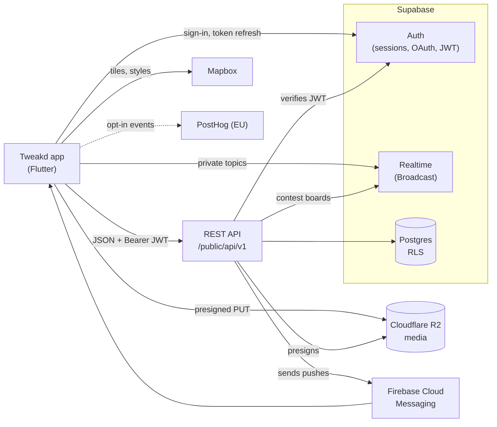

**Supabase owns identity, the REST API owns application data.** The Supabase-issued JWT is the bearer token for every API call. The app never reads application tables directly; everything goes through the API. The only exceptions are the user's own `profiles` row and a few account-level RPCs.

## Architecture

### Layers and dependency rule

Each feature under `lib/features/<name>/` is a self-contained module split into three layers. Dependencies only point inward, and the domain layer has no Flutter imports.

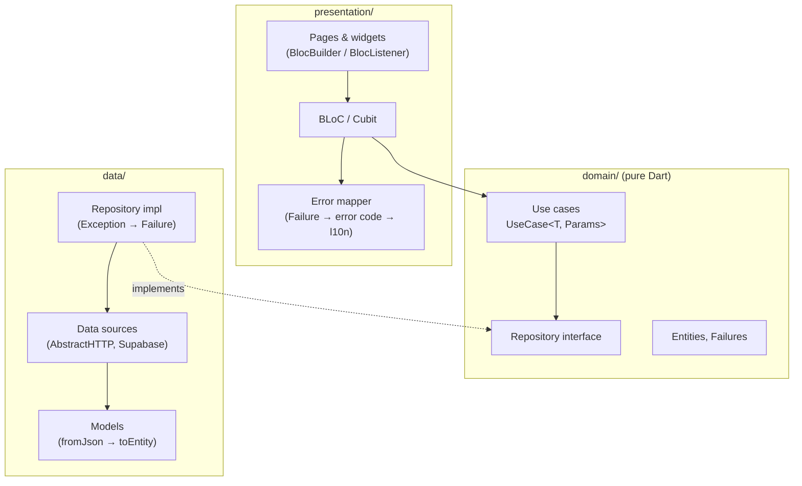

```
lib/
├── main.dart                 # Startup sequence (see "Startup performance")
├── core/
│   ├── analytics/            # AnalyticsService interface + PostHog impl
│   ├── deeplinks/            # Universal/App Link handling, pure URL → route mapping
│   ├── di/                   # get_it container, @module registrations
│   ├── error/                # Base exceptions and failures
│   ├── network/              # AbstractHTTP, DioHttpClient, auth + rate-limit interceptors
│   ├── push/                 # FCM service, background handler, tap → route navigator
│   ├── realtime/             # DM and contest realtime services (interface + Supabase impl)
│   ├── routes/               # go_router configuration
│   ├── services/             # Image compression/upload, share sheet, navigation launcher
│   ├── shared/               # Cross-feature widgets, entities, layout policy
│   ├── storage/              # Secure storage adapters (session, locale, theme)
│   ├── theme/                # Colors, theme data, icons, wordmark
│   ├── usecases/             # UseCase<Type, Params> + NoParams
│   └── utils/                # Core error mapper, validators, startup tracing
├── features/
│   └── <feature>/
│       ├── domain/           # entities/, repositories/ (abstract), usecases/, failures/
│       ├── data/             # models/, datasources/, repositories/ (impl), exceptions/
│       └── presentation/     # bloc/, pages/, widgets/, utils/ (error mapper)
└── l10n/                     # app_en.arb, app_ro.arb + generated localizations
```

Rules the codebase follows:

- Repository **interfaces** live in `domain/`, **implementations** in `data/`.
- BLoCs depend on **use cases**, never on repositories or data sources.
- Third-party exceptions never leave the data layer. Failures never reach the UI as strings: BLoCs emit an error **code**, and widgets turn it into localized copy.
- Pages are pure consumers of state. Sub-widgets live in their own files under `presentation/widgets/`.

### A request, end to end

User search is the smallest feature that exercises every layer, including debouncing and request cancellation. These are trimmed excerpts from the real code.

**Data source** calls the API through the `AbstractHTTP` interface and parses into models:

```dart
// features/search/data/datasource/search_api_data_source.dart
Future<List<SearchResultModel>> searchUsers(String query, {CancelToken? cancelToken}) async {
  final data = await http.get('/profile/search',
      queryParameters: {'q': query}, cancelToken: cancelToken);
  return (data as List<dynamic>)
      .map((e) => SearchResultModel.fromJson(e as Map<String, dynamic>))
      .toList();
}
```

**Repository** converts exceptions into typed failures and models into entities:

```dart
// features/search/data/repositories/search_repository_impl.dart
try {
  final results = await searchApiDataSource.searchUsers(query, cancelToken: cancelToken);
  return Right(results.map((m) => m.toEntity()).toList());
} on RequestCancelledException {
  return const Left(RequestCancelledFailure());
} on NetworkException {
  return const Left(NetworkFailure('No internet connection.'));
} on ServerException catch (e) {
  return Left(ServerFailure(e.message));
} // ...
```

**Use case** is the single entry point the presentation layer may call:

```dart
// features/search/domain/usecases/search_users.dart
@lazySingleton
class SearchUsersUseCase implements UseCase<List<SearchResultEntity>, SearchUsersParams> {
  @override
  Future<Either<Failure, List<SearchResultEntity>>> call(SearchUsersParams params) =>
      repository.searchUsers(params.query, cancelToken: params.cancelToken);
}
```

**BLoC** debounces typing (300 ms, minimum 2 characters), cancels the in-flight request when the query changes, and folds the `Either`:

```dart
// features/search/presentation/bloc/bloc.dart
final result = await searchUsers(SearchUsersParams(query: event.query, cancelToken: token));
if (token.isCancelled) return; // a newer query already superseded this one

result.fold(
  (failure) {
    if (failure is RequestCancelledFailure) return;
    emit(SearchError(query: event.query, code: SearchErrorMapper.getCode(failure)));
  },
  (results) {
    analytics.track(AnalyticsEvents.searchPerformed, {'result_count': results.length});
    emit(SearchSuccess(query: event.query, results: results));
  },
);
```

**Widget** resolves the error code to localized copy, since only the widget tree has an `AppLocalizations`:

```dart
String searchErrorMessage(AppLocalizations l10n, SearchErrorCode code) => switch (code) {
  SearchErrorCode.generic => l10n.searchErrorGeneric,
};
```

### Dependency injection

`get_it` + `injectable` generate the container at build time ([`lib/core/di/`](lib/core/di/)). Each class declares its own lifetime with an annotation, so there is no hand-maintained registration list to drift out of sync, and the generated wiring is plain Dart you can read and step through.

| Annotation | Used for |
|---|---|
| `@lazySingleton` | Data sources, repositories, use cases, services |
| `@LazySingleton(as: Interface)` | Binding an implementation to its interface (`DioHttpClient` → `AbstractHTTP`, `SupabaseDmRealtimeService` → `DmRealtimeService`) |
| `@injectable` (factory) | BLoCs and Cubits, so every screen gets a fresh instance |
| `@module` | Third-party objects that need manual construction (`Dio`, `SupabaseClient`, `AppLinks`) |

### Routing and BLoC provisioning

`go_router` is configured in [`lib/core/routes/app_router.dart`](lib/core/routes/app_router.dart). A page's `BlocProvider` is created in the **route's builder**, not inside the page, so pages stay free of DI and can be widget-tested with any BLoC:

```dart
GoRoute(
  path: '/profile',
  builder: (context, state) => BlocProvider<ProfileBloc>(
    create: (_) => getIt<ProfileBloc>()..add(FetchUserProfileData()),
    child: const ProfilePage(),
  ),
),
```

Redirects guard routes that need state, such as a contest editor that requires its event. Every route that a push notification or deep link can open is a **plain path**, with no required `extra`, so it can always be reached from an id alone.

## Core subsystems

### Networking and the error pipeline

All HTTP goes through `AbstractHTTP`. [`DioHttpClient`](lib/core/network/dio_http_client.dart) is the **only** place that knows about `DioException`, and it translates every failure into an app-owned exception:

| Dio outcome | App exception | Typical failure |
|---|---|---|
| Cancelled | `RequestCancelledException` | Silently ignored by the BLoC |
| Connection error or timeout | `NetworkException` | `NetworkFailure` |
| `401` | `UnauthenticatedException` | Feature-specific (for example, sign the user out) |
| `409` | `ConflictException(errorCode, details)` | Domain-specific (for example, a post cooldown with `next_post_allowed_at`) |
| `429` | `TooManyRequestsException(retryAfter, limit)` | Also reported to the app-wide rate-limit banner |
| `5xx` | `ServerException` | `ServerFailure` |
| Any other status | `ApiException(statusCode, errorCode)` | Mapped per feature |

The backend's error envelope (`error`, `message`, `details`) is parsed once, here. Feature repositories add their own exceptions and failures on top. For example, `AuthRepositoryImpl` keeps a single exception→failure table, so a new call site can't accidentally collapse a specific error into a generic one.

**Rate limiting.** A `RateLimitInterceptor` reports every `429` to a `RateLimitNotifier`. One `RateLimitBanner` at the app root then explains the wait, using `Retry-After` or `details.retry_after_seconds`. Features don't each need their own copy. The interceptor deliberately never retries, because a request retried straight away would only be refused again.

### Authentication

**Hybrid model.** Supabase issues and refreshes the session; the REST API verifies the JWT. An [`AuthInterceptor`](lib/core/network/auth_interceptor.dart) attaches it to every request. It also handles a subtle cold-start race: an app reopened after the access token expired would otherwise fire its first requests with a dead JWT.

```dart
// A cold start restores the saved session as-is and refreshes it in the background,
// so wait for the refresh instead of sending a dead JWT. Concurrent requests share
// one refresh (the SDK de-duplicates it).
if (auth.currentSession?.isExpired ?? false) {
  try { await auth.refreshSession(); } catch (_) { /* let the 401 path handle it */ }
}
final token = auth.currentSession?.accessToken;
if (token != null) options.headers['Authorization'] = 'Bearer $token';
```

**Flows and decisions:**

- **Email sign-up and password reset use typed OTP codes, not magic links.** A code can be read on any device, while a link only completes on the device that started the flow. Resend has a 60-second cooldown that matches Supabase's email rate limit. A successful password reset revokes every other session.
- **No account enumeration.** Signing up with an email that's already registered returns the same result as a new sign-up, so the form can't be used to find out who has an account.
- **Sign-in never creates accounts.** Supabase creates an auth user the first time it sees a Google or Apple identity, whichever screen the button was on. Every social sign-in therefore carries a `SocialAuthIntent`:
  - `SignUpIntent` records terms acceptance and analytics consent through an RPC.
  - `SignInIntent` checks for a completed registration. If there isn't one, the half-created account is deleted through a `discard_unregistered_account` RPC, and the login page offers "Create account" instead.
- **Session persistence.** Supabase's session is stored in the iOS Keychain / Android Keystore through a `flutter_secure_storage` adapter plugged into `FlutterAuthClientOptions`.
- **Sign-out order matters.** The device's push registration is removed *before* the session is torn down, because the request authenticating that removal needs the session it is retiring. Realtime topics, the feed cache, queued badge celebrations and the analytics identity are cleared too, so nothing leaks into the next account on the same device.

### Realtime: direct messages and contests

Supabase Realtime bills for **peak concurrent connections** and **delivered messages**. The design is therefore built around holding as few sockets and topics as possible. **Nothing joins Realtime at app start.**

**Direct messages** ([`lib/core/realtime/`](lib/core/realtime/)) use Realtime Broadcast on private `user:<uuid>` topics:

```mermaid
sequenceDiagram
    participant A as Sender app
    participant API as REST API
    participant RT as Supabase Realtime
    participant B as Recipient app

    Note over B: Inbox or chat open → retain() joins topic user:B (read allowed by RLS)
    A->>API: POST message (durable write)
    API-->>A: 201 + full message
    A->>RT: httpSend to topic user:B (write-only for peers)
    A->>RT: httpSend to topic user:A (sender's other devices)
    RT-->>B: message.created
    Note over B: Chat closed → release(); last holder leaves, so the socket can close
```

- **Ref-counted topic.** The inbox and the chat screen each `retain()` the viewer's own topic, and the last `release()` leaves it. While neither is open, the app holds no socket; the unread badge refreshes over REST instead.
- **Write-only peer topics.** RLS on `realtime.messages` lets a user *read* only their own topic and *write* to a peer's topic only if they already share a conversation. Realtime refuses a join without read permission, so outbound events go through Realtime's HTTP broadcast endpoint (`httpSend`), which needs no subscription.
- **Display-only events.** The REST API is the source of truth. A dropped broadcast costs a live update, never data. On every (re)subscribe, the service emits `DmConnectedEvent` and listeners refetch whatever they might have missed in the background.
- **Resilience.** A refused or timed-out join retries with exponential backoff (1 s up to 32 s), using whatever token is current by then. Typing signals are throttled and never queued.
- **A subtle auth bug, fixed.** `supabase_flutter` seeds the Realtime socket with the *publishable key*. If the join happens before an auth event updates it, RLS evaluates the join as `anon` and denies it. The service explicitly calls `realtime.setAuth(userJwt)` before every join.

**Event contests** use a per-event topic, `event:<id>:contests`, that only the backend publishes to (debounced after votes, and on status changes). Subscriptions are ref-counted per event, so the contests tab and an open contest page share one channel. When the channel isn't live, the BLoC falls back to polling.

### Push notifications

[`lib/core/push/`](lib/core/push/) wraps FCM behind a `PushNotificationService` interface, so no feature imports `firebase_messaging` directly and the whole layer can be stubbed in tests.

- **Background isolate does nothing on purpose.** The backend sends a `notification` block, so the OS draws the notification itself. The background handler only exists because without one Android drops the `data` payload, which is what the deep link is built from.
- **Taps never bypass auth.** `PushNavigator` parks a tapped destination until the app has landed on its first authenticated screen. A cold-start notification is consumed once (`takeInitialMessage`), so a hot restart can't replay it.
- **One routing function.** A push tap and a tap in the in-app notifications list resolve through the same `notificationRouteFor`, so the two can't drift apart.
- **Token lifecycle.** The notifications feature registers the FCM token with the backend after sign-in, re-sends it on every `onTokenRefresh`, and removes it on sign-out.

### Deep links

Garage share links (`https://web.tweakdapp.com/c/{code}`) and event links (`/e/{id}`) open the app through Universal Links (iOS) and App Links (Android), with a `tweakd://` custom scheme as a fallback for the website's "Open in app" button.

- **Flutter's built-in deep linking is deliberately disabled.** It hands *every* incoming URL to `go_router`, including Supabase's OAuth callbacks (`tweakd://login-callback`). That produced a "no route" error page instead of the splash, which left the native launch screen up forever. [`DeepLinkService`](lib/core/deeplinks/deep_link_service.dart) listens to the same `app_links` stream Supabase uses and only acts on URLs it recognizes.
- **URL → route mapping is a pure function** ([`share_link_route.dart`](lib/core/deeplinks/share_link_route.dart)), unit-tested separately. It recognizes the URL's shape only and leaves code validation to the backend, so the two can't disagree.
- **Cold-start replays are de-duplicated.** The launch URL can arrive twice (`getInitialLink` plus a replay on the stream), so an identical URL within 3 seconds is ignored.
- **Navigation waits for a real screen,** for the same reason as push: the splash finishes with `context.go('/feed')`, which would wipe out a route pushed a moment earlier.

### Startup performance

The launch path in [`main.dart`](lib/main.dart) is built to show real content as soon as possible:

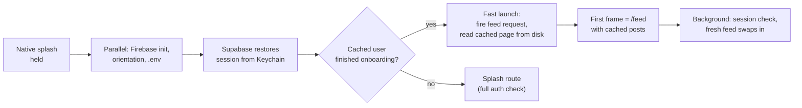

- **Optimistic launch.** If the device remembers that the restored user has finished onboarding, the app goes straight to `/feed` with no network round trip. A background `SessionCheckCubit` moves the user only if the server disagrees.
- **Feed preloading.** The first feed request goes out *before the UI exists*, and the cached first page is read from disk in parallel. The cache stores the raw response body and parses it with the same model as a live response, so there's no second serialization to drift out of date. It has no expiry, because a slightly stale feed beats a skeleton. It's scoped to the user and deleted on sign-out.
- **No jumpy list.** If the user hasn't scrolled yet, fresh content replaces the cached page in place. Otherwise a "New posts" pill appears.
- **Measured, not guessed.** `StartupTrace` drops timeline markers in profile builds (it's compiled out of release builds), so each phase of the launch can be measured in DevTools.

### Media uploads

1. When the user picks a photo, **WebP compression starts immediately** (`CompressedImage.compress`). It runs while they fill in the rest of the form, and the upload awaits a future that has usually already finished.
2. The app asks the API for a **presigned URL** and `PUT`s the bytes straight to Cloudflare R2. Media never passes through the API server.
3. The app saves the **R2 object key**, not a URL, so the storage domain or CDN can change without a data migration.

### Analytics and privacy

- **Opt-in, stored on the account.** Consent is recorded at sign-up and can be changed in Settings. Until it's granted, `track` and `screen` are no-ops, so call sites never check consent themselves.
- **Vendor behind an interface.** Features depend on `AnalyticsService`. `PostHogAnalyticsService` is the only file that imports the SDK, and `NoopAnalyticsService` is the default in tests.
- **Data minimization.** Events fire only after the backend confirms the action. Properties are limited to enums, counts and booleans: no free text, and never another user's id or username. Screen names are route *patterns* (`/users/:username`), never filled-in paths. Users are identified only by their Supabase UUID. Data is hosted in the EU.

### Localization, theming and responsive layout

- **Localization.** ARB files with `gen-l10n` (English and Romanian). A `LocaleCubit` at the app root follows the system locale by default and can be pinned in Settings; switching applies live, with no restart.
- **Theming.** Light, dark and system modes through a `ThemeModeCubit`, persisted locally. The native launch screen also has light and dark variants, so the handoff to Flutter is seamless.
- **Responsive layout.** Screens are built to work from a 320 pt iPhone SE up to a 12.9" iPad, and at large accessibility text sizes. `OrientationPolicy` keeps phones in portrait and lets tablets and unfolded foldables rotate. It decides by the window's *shortest side*, which doesn't change on rotation, and re-decides when a foldable opens or closes. Layout tests pin these sizes; see [Testing strategy](#testing-strategy).

## Security posture

- **No secrets in the client.** Only client-safe values ship in the app: the Supabase publishable key, OAuth client IDs, and Mapbox and PostHog public tokens. They're loaded from a gitignored `.env` and `dart_defines.*.json` (templates: [`.env.example`](.env.example), [`dart_defines.example.json`](dart_defines.example.json)).
- **Deny-by-default database.** Row-level security is enabled on every application table. Tables the client has no business reading have no policies, so the publishable key can't read or write them; that data is only reachable through the authenticated API.
- **Private realtime topics** are authorized through RLS on `realtime.messages` (see [Realtime](#realtime-direct-messages-and-contests)).
- **Server-side enforcement.** Blocking, privacy-gated garages and rate limits are enforced by the API. A blocked profile simply reads as 404. The client only reflects these rules; it doesn't decide them.
- **Session storage** uses the platform keystore. Password reset revokes other sessions. Sign-out clears every per-user cache on the device.

## Testing strategy

```bash
flutter test     # 950+ tests, runs in under a minute
```

| Kind | What it covers | Examples |
|---|---|---|
| **BLoC / Cubit** | State transitions, success and failure branches, cancellation | `map_search_bloc_test`, `contest_detail_bloc_test`, `blocked_accounts_bloc_test`, `badge_celebration_cubit_test` |
| **Models** | JSON parsing against the API contract, edge cases and missing fields | `feed_page_model_test`, `contest_models_test`, `post_repost_model_test` |
| **Pure logic** | Routing and validation rules with no Flutter dependency | `share_link_route_test`, `notification_routing_test`, `auth_validation_test`, `qr_png_rasterizer_test` |
| **Infrastructure** | Interceptors, caches, realtime connection behavior | `rate_limit_interceptor_test`, `feed_launch_cache_test`, `dm_live_connection_test` |
| **Layout** | No overflow at iPhone SE (320×568), iPhone (390×844) and iPad (1024×1366), and at large text scales | `register_car_layout_test`, `profile_layout_test`, `contests_layout_test` |
| **Widget behavior** | Interactions and navigation timing | `follow_button_test`, `fullscreen_image_zoom_test`, `route_uncovered_test` |

**No mocking framework.** Dependencies are injected through interfaces, so tests use small hand-written fakes (for example, a `_FakeRealtime implements DmRealtimeService`). Cross-cutting services default to no-op implementations in constructors, so a test only supplies the collaborators it cares about.

## Trade-offs and known limitations

Decisions I'd be happy to discuss, including what I'd change:

- **Domain purity vs. cancellation.** Repository interfaces that support cancellation take dio's `CancelToken`, so those domain files import `dio`. A domain-owned cancellation type would be purer; I chose the pragmatic route because it avoids an adapter on every call.
- **Two backends.** Supabase for identity and realtime plus a custom API for data adds a moving part. In exchange, I get managed auth and realtime with full control over business logic and data access.
- **Optimistic launch.** The fast path trusts the device's memory of onboarding status. The background session check corrects it in the rare case it's wrong; the visible cost is a single redirect.
- **Android Apple sign-in intent** is held in memory. If Android kills the app while the browser is open, the returning session skips the "sign-in never creates accounts" check. This is a known, documented gap.
- **Realtime cost vs. freshness.** Outside the inbox and chat, the unread badge is refreshed over REST and push rather than kept live, a deliberate cost trade-off.

## Getting started

### Prerequisites

- Flutter SDK (Dart `^3.11`)
- Xcode (iOS) and/or Android Studio (Android)
- A Mapbox **secret** token with `DOWNLOADS:READ` scope configured on your machine, so the native Mapbox SDK can be downloaded (see [`lib/features/map/README.md`](lib/features/map/README.md))

### Setup

```bash
# 1. Install dependencies
flutter pub get

# 2. Configure environment (fill in your own values)
cp .env.example .env
cp dart_defines.example.json dart_defines.dev.json

# 3. Generate dependency-injection code
dart run build_runner build --delete-conflicting-outputs

# 4. Run (the dart-defines file carries compile-time tokens such as Mapbox)
flutter run --dart-define-from-file=dart_defines.dev.json
```

Firebase is configured through `lib/firebase_options.dart`. To use your own Firebase project, regenerate it with `flutterfire configure` and add the platform config files (`google-services.json`, `GoogleService-Info.plist`), which are intentionally gitignored.

> The app depends on a private API and Supabase project. A fresh clone builds and runs, but you need your own services to sign in and load data.

### Useful commands

```bash
flutter analyze                                           # static analysis
flutter test                                              # all tests
flutter test test/features/garage                         # one feature's tests
dart run build_runner watch --delete-conflicting-outputs  # DI codegen in watch mode
flutter gen-l10n                                          # regenerate localizations
flutter run --profile --dart-define-from-file=dart_defines.dev.json  # measure startup
```

## Project status

Tweakd is **in active development**. Social, garage, map, events, messaging and notification features work end-to-end against the API. Current work is UX polish and preparation for a public release.

---

<div align="center">

Built by **[@1Divy1](https://github.com/1Divy1)**

<sub>© Tweakd. All rights reserved. The source is public for portfolio review; it is not licensed for reuse or redistribution.</sub>

</div>
